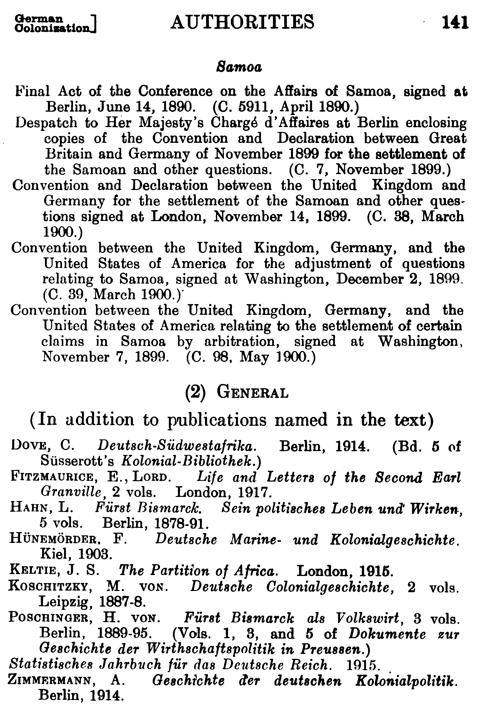

This R data package provides access to texts of Peace Books (PB), reference reports 
prepared by the Historical Section of the British Foreign Office between 1918 and 1919
for use by the British Delegation at the Paris Peace Conference in 1919. 
The reports were published in 1920 in English. The individual volumes contain 
reference information regrading geography, culture, population, and economy of 
almost all countries and territories in the world. 

The package enables text analysis of the individual volumes. The list of references 
were removed from the corpus together with appendices, tables, 
tables of content, and other paratext.

## Installation
`remotes::install_github("standap/peaceBooksR")`

## Run the data
After installing `peaceBooksR`, just run the name of the dataset. The data frame is ready to be used as is. The data are already in the tidy format.

### Examples
```   
# Number of lines in each volume  
peace_books_pages |> 
  count(volume_title, sort = TRUE)
```

```
# distribution of volumes by continent 
peace_books_volumes |> 
  count(continent)
```

```
# Distribution of languages of resources in the authorities datasets
peace_books_authorities |> 
  count(lang_label, sort = TRUE) |> 
  head()
```

```
# Number of volumes in the firtst bound volumes of the `Peace books`.

peace_books_ids |> 
  count(htid, title_vol) |> 
  head(5)
```


## Processing and organization of data
The introductory section, some 36 lines, that is at the beginning of each digitized volume were removed. This section contains administrative information about each volume, including its title, authors, and publisher, as well as URL to the source file, information regarding copyright and OCR procedures. Subsequently, running headers and footers, empty lines, page numbers, and other paratext elements were removed, as well. Word strings split by hyphens at the end of the lines were joined. Finally,  m- and n-dashes, as well as quotation marks were removed.  Most of these removals were executed by a `sed` script and regular expressions, but many typos and extraneous characters were removed manually during visual inspections of the texts. 

The page-based organization of the volumes with line breaks after each line of text was preserved in the dataset `peace_books_pages`. Since some methods require the text as uninterrupted flow of text of each volume. The dataset `peace_books_volumes` contains 160 rows  with the full text of each volume in one row.

Although the lists of references (authorities) were removed from the corpus, they were transformed into a separate dataset `peace_books_authorities` that is part of this data package, as well.
  


## Provenance
The corpus was created from twenty five bound volumes in the [Hathi Trust Digital Library](https://www.hathitrust.org/). 
Volumes on the German Opinion in volume 24 are not included in the corpus. 

Table: List of bound volumes and their titles that constitute the `peaceBooks` corpus

| htid               | title                                                       | volume |
|--------------------|-------------------------------------------------------------|-------:|
| mdp.39015039471258 | Austria-Hungary (I)                                         |      1 |
| mdp.39015064326716 | Austria-Hungary (II)                                        |      2 |
| mdp.39015010785791 | Balkan States (I)                                           |      3 |
| mdp.39015064326732 | Balkan States (II)                                          |      4 |
| mdp.39015064326740 | Benelux                                                     |      5 |
| wu.89004522017     | France, Italy, Spain, etc.                                  |      6 |
| mdp.39015011939983 | Germany                                                     |      7 |
| mdp.39015064326864 | Poland and Finland                                          |      8 |
| iau.31858044687006 | The Russian Empire                                          |      9 |
| mdp.39015010785874 | Mohammedanism: Turkey in Asia (I)                           |     10 |
| iau.31858044687022 | Turkey In Asia (II)                                         |     11 |
| iau.31858044687030 | China, Japan, Siam                                          |     12 |
| iau.31858044687048 | Persian Gulf: French and Portuguese Possessions             |     13 |
| iau.31858044687055 | Dutch and British Possessions                               |     14 |
| iau.31858044687063 | Partition of Africa: British Possessions (I)                |     15 |
| iau.31858044687071 | British Possessions (II): The Congo                         |     16 |
| iau.31858044687089 | French African Possessions                                  |     17 |
| iau.31858044687097 | German African Possessions (Late)                           |     18 |
| iau.31858044687105 | Portuguese Possessions                                      |     19 |
| iau.31858044871808 | Spanish And Italian Possessions: Independent States         |     20 |
| iau.31858044687113 | North, Central And South America: Atlantic Islands          |     21 |
| iau.31858044687121 | Pacific Islands                                             |     22 |
| iau.31858044687139 | International Affairs                                       |     23 |
| iau.31858044687147 | Congresses: German Opinion                                  |     24 |
| iau.31858044687154 | Indemnities, Plebiscites, Indemnities In Previous Wars      |     25 |
